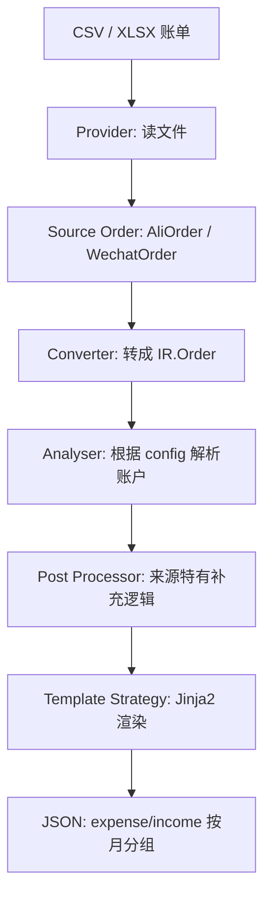

# Fane 项目导览

这篇文档写给“隔了两个月回来，已经忘了自己当时怎么想”的你。

Fane 的核心目标很简单：

> 把支付宝、微信等账单文件转换成按月份分组的 Beancount 记账文本。

它不是一个完整账本系统，而是一个“账单转换器”。它读取第三方账单，套用你在 `config.yaml` 里写的账户规则，生成可粘贴到 Beancount 月度账本里的交易文本。

## 一句话架构

```text
账单文件
  -> Provider 读取原始 CSV/XLSX
  -> Converter 转成统一 IR
  -> Analyser 根据 config 解析账户
  -> Post Processor 做来源特有的补充处理
  -> Template Strategy 渲染 Beancount
  -> JSON 输出 expense/income 按月份分组
```

对应代码：

```text
main.py
package/cmd/
provider/
ir/
package/parser/
package/compiler/
package/strategy/
package/template/
```

## 怎么运行

项目入口是 `main.py`：

```bash
.venv/bin/python main.py --config example/config.yaml trans --provider alipay --source example/2.csv
```

微信账单：

```bash
.venv/bin/python main.py --config example/config.yaml trans --provider wechat --source example/3.xlsx
```

如果安装成命令行工具，则脚本名是 `fa`，定义在 `pyproject.toml`：

```toml
[project.scripts]
fa = "package.cmd:app"
```

默认配置路径是：

```text
~/.flow/config.yaml
```

但本项目样例使用：

```text
example/config.yaml
```

注意：`example/` 当前被 Git 忽略，所以里面的配置改动可能不会出现在 `git status` 里。

## 目录结构

```text
Fane/
  main.py                         CLI 启动入口
  ir/                             项目内部统一订单模型
  provider/                       不同账单来源的读取和初步转换
    base.py                       表格账单 Provider 基类
    registry.py                   provider 注册表
    ali/                          支付宝账单
    wechat/                       微信账单
  package/
    cmd/                          Typer CLI 命令
    config/                       YAML 配置读取和 Pydantic 配置模型
    parser/                       根据规则解析账户的 analyser
    compiler/                     转换流水线协调器
    strategy/                     渲染策略
    template/                     Jinja2 模板
  tests/                          回归测试
```

## 核心概念

### Provider

Provider 负责“读账单文件”。

入口在：

```text
provider/base.py
```

`TabularProvider` 定义了通用流程：

```text
translate(filename)
  -> validate_source()
  -> iter_rows()
  -> parse_order()
  -> convert_orders()
```

子类只关心三件事：

```python
def iter_rows(...)
def parse_order(...)
def convert_orders(...)
```

当前已有两个 provider：

```text
provider/ali/alipay.py
provider/wechat/wechat.py
```

Provider 注册在：

```text
provider/registry.py
```

新增来源时，最后要把 factory 放进这里：

```python
PROVIDERS = {
    "alipay": AliPay,
    "wechat": Wechat,
}
```

### 原始订单类型

Provider 读出来后，会先变成来源自己的 dataclass：

```text
provider/ali/ali_types.py       AliOrder
provider/wechat/wechat_types.py WechatOrder
```

这些类型描述的是“支付宝/微信原始账单字段”，还不是项目内部统一订单。

### IR

IR 是项目内部统一模型，定义在：

```text
ir/ir.py
```

最重要的是：

```python
class Order:
    peer: Optional[str]
    item: str
    money: Decimal
    pay_time: Optional[datetime]
    type: Optional[Type]
    method: str
    minus_account: str
    plus_account: str
    minus_str: str
    plus_str: str
    meta_data: dict[str, str]
    tags: list[str]
```

你可以把 `Order` 理解成：

> 一条准备被渲染成 Beancount 的交易。

其中：

```text
minus_account  出钱账户，模板里通常渲染为负数
plus_account   收钱账户，模板里通常渲染为正数
minus_str      手写负向金额字符串，用于外币/特殊交易
plus_str       手写正向金额字符串，用于外币/特殊交易
meta_data      原始账单元数据，如 order_id、status、method
```

`IR` 只是包一层：

```python
class IR:
    orders: list[Order]
```

### Converter

Converter 把来源自己的订单转成 IR：

```text
provider/ali/converter.py
provider/wechat/converter.py
```

比如支付宝流程是：

```text
AliOrder -> get_public_meta_data() -> Order
         -> get_private_meta_data() -> meta_data
         -> IR
```

此时订单还没有真正的 Beancount 账户，只是带了原始 `method`、`peer`、`item`、`type` 等字段。

### Analyser

Analyser 负责：

> 根据 `config.yaml` 中的规则，把订单映射到 Beancount 账户。

入口：

```text
package/parser/analyser.py
```

注册表：

```python
ANALYSERS = {
    "alipay": AlipayAnalyser,
    "wechat": WechatAnalyser,
}
```

具体实现：

```text
package/parser/ali/alipay.py
package/parser/wechat/wechat.py
```

它们都复用同一个规则解析器：

```text
package/parser/rule_resolver.py
```

规则解析器输出：

```python
AccountResolutionTuple = tuple[
    bool,           # ignore
    Optional[str],  # minus_account
    Optional[str],  # plus_account
    dict[str, str], # extra_account
    list[str],      # tags
]
```

也就是说，一条订单经过 analyser 后，会得到：

```text
是否忽略
出钱账户
收钱账户
额外账户
标签
```

## 一次转换的完整调用链

以这个命令为例：

```bash
.venv/bin/python main.py --config example/config.yaml trans --provider alipay --source example/2.csv
```

### 1. main.py 启动 Typer

```text
main.py
```

做三件事：

```python
import package.cmd
from package.cmd.root import app
import package.cmd.trans
```

这里 `import package.cmd.trans` 的作用是注册 `trans` 子命令。

### 2. root callback 加载配置

```text
package/cmd/root.py
```

`initialize()` 会先执行，加载配置文件：

```python
cfg.init_config(cfg_file)
```

配置读取在：

```text
package/config/init.py
```

最终会变成：

```python
Config
```

配置模型定义在：

```text
package/config/config.py
```

### 3. trans 命令创建 provider/analyser

```text
package/cmd/trans.py
```

根据 `--provider alipay` 创建：

```python
p = create_provider("alipay")
analyser = create_analyser("alipay")
```

它们分别来自：

```text
provider/registry.py
package/parser/analyser.py
```

### 4. provider 读取账单并转成 IR

```python
s = p.translate(source)
```

支付宝会走：

```text
provider/ali/alipay.py
provider/ali/converter.py
```

输出：

```python
IR(orders=[...])
```

### 5. Compiler 执行流水线

```python
Compiler(provider, config, s, NormalStrategy(), analyser).compile()
```

核心在：

```text
package/compiler/compiler.py
```

`build_result()` 做三步：

```python
self.ir.orders = self.resolve_accounts(...)
self.ir = apply_post_processor(...)
self.render_orders(...)
```

也就是：

```text
账户解析
  -> provider 后处理
  -> 模板渲染
```

### 6. Template 渲染 Beancount

渲染策略：

```text
package/strategy/template/normal.py
```

模板：

```text
package/template/normal.j2
```

模板会输出类似：

```beancount
2026-05-14 * "中国工商银行" "信用卡还款"
    Liabilities:CreditCard:ICBC-8393              794.23 CNY
    Assets:MMF:Alipay:YuEBao                     -794.23 CNY
```

### 7. 最终输出 JSON

CLI 最后 `print(json.dumps(...))`。

结构是：

```json
{
  "expense": {
    "05": ["beancount text", "..."]
  },
  "income": {
    "05": ["beancount text", "..."]
  }
}
```

月份来自交易文本开头的日期：

```text
2026-05-14 -> 05
```

## config.yaml 怎么理解

配置主要分三块：

```yaml
default-minus-account: Assets:FIXME
default-plus-account: Expenses:FIXME
default-currency: CNY

alipay:
  rules:
    ...

wechat:
  rules:
    ...

foreign-credit-card-repayments:
  ...
```

### 默认账户

如果没有任何规则匹配，就用：

```yaml
default-minus-account: Assets:FIXME
default-plus-account: Expenses:FIXME
```

这样不会丢交易，只是用 FIXME 提醒你后续修规则。

### 支付宝/微信 rules

规则长这样：

```yaml
- peer: 中国移动
  target-account: Expenses:Utilities:Phone
```

或：

```yaml
- method: 余额宝
  full-match: true
  method-account: Assets:MMF:Alipay:YuEBao
```

字段含义：

```text
peer            匹配交易对方
item            匹配商品说明
method          匹配支付方式
category        匹配分类
type            匹配收/支
note            支付宝备注，当前不再用它生成特殊业务
tx_type         微信交易类型
method-account 付款方式对应的账户
target-account 交易目标账户
ignore          是否忽略
tags            标签
separator       多值分隔符，默认逗号
time            匹配一天内的时间段，例如 08:00..09:00
timestamp-range 匹配完整日期/时间区间，例如 2026-06-01..2026-06-30
min-price       最小金额，闭区间
max-price       最大金额，闭区间
```

也可以把金额字段写成更直观的别名：

```yaml
min-amount: 7.00
max-amount: 8.00
```

时间和金额可以组合使用。比如“2026 年 6 月内，金额在 100 到 200 之间的支付宝支出，都归到 groceries”：

```yaml
alipay:
  rules:
    - timestamp-range: 2026-06-01..2026-06-30
      min-price: 100.00
      max-price: 200.00
      target-account: Expenses:Food:Groceries
```

再比如“每天早上 8 点到 9 点，金额在 7 到 8 元之间的微信交易，归到公交”：

```yaml
wechat:
  rules:
    - time: 08:00..09:00
      min-amount: 7.00
      max-amount: 8.00
      target-account: Expenses:Transport:Bus
```

区间是闭区间，也就是包含起止边界。`timestamp-range` 支持：

```text
YYYY-MM-DD
YYYY-MM-DD HH:MM
YYYY-MM-DD HH:MM:SS
```

`time` 支持：

```text
HH:MM
HH:MM:SS
```

规则不是“匹配第一条就停止”。它会从上到下扫，匹配到的规则会继续覆盖账户，除非：

```yaml
ignore: true
```

所以一般写法是：

```text
宽泛规则在前
具体规则在后
```

因为后面的规则可以覆盖前面规则。

## 账户解析规则

核心在：

```text
package/parser/rule_resolver.py
```

规则里有两个账户字段：

```text
method-account
target-account
```

对支出类交易：

```text
method-account -> minus_account
target-account -> plus_account
```

对收入类交易：

```text
method-account -> plus_account
target-account -> minus_account
```

这就是为什么同一个规则字段可以同时处理收入和支出。

退款有特殊逻辑：

```python
order.item.startswith("退款")
```

如果是退款，会把正负账户互换。

## 支付宝后处理

支付宝后处理在：

```text
provider/ali/processor.py
```

它现在只做两类事。

### 1. 过滤无效交易

这些交易会被过滤：

```text
交易关闭 + 不计收支
等待确认收货
```

原因是这些通常不应该入账。

### 2. 外币信用卡还款自动追加

你的外币信用卡还款逻辑现在是：

```text
余额宝 -> 4931
4931 -> 外币信用卡
```

第一条“余额宝提现到 4931”保留，因为它是真实银行流水。

第二条“4931 还外币信用卡”由后处理自动追加。

配置在：

```yaml
foreign-credit-card-repayments:
  - trigger-minus-account: Assets:MMF:Alipay:YuEBao
    trigger-plus-account: Assets:DebitCard:ICBC:4931
    liability-account: Liabilities:CreditCard:ICBC-5788
    ledger-file: /Users/enmu/nexus/flow/Bills/main.bean
    currency: USD
    peer: 中国工商银行
    item: 外币信用卡还款
```

匹配条件是：

```text
当前订单 minus_account == trigger-minus-account
当前订单 plus_account  == trigger-plus-account
```

也就是：

```text
Assets:MMF:Alipay:YuEBao -> Assets:DebitCard:ICBC:4931
```

如果匹配，就读取主账本：

```text
/Users/enmu/nexus/flow/Bills/main.bean
```

并递归解析 `include`，计算：

```text
Liabilities:CreditCard:ICBC-5788 的 USD 余额
```

如果余额是负数，比如：

```text
-23.22 USD
```

就生成还款金额：

```text
23.22 USD
```

自动追加的交易大概是：

```beancount
2026-06-13 * "中国工商银行" "外币信用卡还款"
    Liabilities:CreditCard:ICBC-5788    23.22 USD @@ 157.89 CNY
    Assets:DebitCard:ICBC:4931        -157.89 CNY
```

注意：CNY 金额来自支付宝账单里的实际提现金额，不需要配置汇率。

## 为什么不再用 note

之前的 note 方案相当于在备注里塞指令：

```text
icbc_usd;23.22;157.89 usd
```

问题是：

```text
备注不是业务数据源
格式错了不容易发现
以后自己也看不懂
规则隐藏在字符串里
```

现在改成：

```text
真实支付宝流水 + 显式配置 + 主账本余额
```

更容易排查，也更符合复式记账。

## 兼容文件

为了避免旧导入突然坏掉，项目里保留了几个兼容入口。

### package/parser/paser.py

`paser` 拼写是旧名字。

现在真实实现是：

```text
package/parser/analyser.py
```

旧文件只是转发：

```python
Paser = Analyser
get_analyser = create_analyser
```

### provider/wechat/wecaht_types.py

`wecaht_types` 是旧拼写。

现在真实文件是：

```text
provider/wechat/wechat_types.py
```

旧文件只是转发。

### provider/provider.py

旧入口，现在转发到：

```text
provider/registry.py
```

## 如何新增一个账单来源

假设要新增 `cmb`。

### 1. 新建原始类型

```text
provider/cmb/cmb_types.py
```

定义：

```python
@dataclass
class CmbOrder:
    ...
```

### 2. 新建 provider

```text
provider/cmb/cmb.py
```

继承：

```python
class Cmb(TabularProvider[CmbOrder]):
    def iter_rows(...)
    def parse_order(...)
    def convert_orders(...)
```

### 3. 新建 converter

```text
provider/cmb/converter.py
```

把：

```text
CmbOrder -> IR
```

### 4. 新建 rules 模型

```text
provider/cmb/rules.py
```

配置模型要接进：

```text
package/config/config.py
```

### 5. 新建 analyser

```text
package/parser/cmb/cmb.py
```

复用：

```python
RuleAccountResolver
```

### 6. 注册

Provider 注册：

```text
provider/registry.py
```

Analyser 注册：

```text
package/parser/analyser.py
```

如果需要特殊后处理，注册：

```text
package/compiler/post_processors.py
```

## 如何排查问题

### 问题：账单文件缺列

报错来自：

```text
provider/base.py -> ensure_columns()
```

检查 provider 的：

```python
REQUIRED_COLUMNS
```

### 问题：交易状态不支持

报错来自：

```text
provider/base.py -> parse_enum()
```

检查：

```text
provider/ali/ali_types.py
provider/wechat/wechat_types.py
```

### 问题：账户还是 FIXME

说明没有规则匹配，或者规则字段不对。

排查顺序：

```text
1. 看原始账单里的 peer/item/method/category/type
2. 看 config.yaml 规则字段是否写错
3. 看规则顺序，后面的规则会覆盖前面的账户
4. 看是不是退款导致账户互换
```

### 问题：外币还款没有生成

检查：

```text
1. 支付宝提现订单是否被解析成：
   Assets:MMF:Alipay:YuEBao -> Assets:DebitCard:ICBC:4931

2. foreign-credit-card-repayments 是否配置了同样的 trigger 账户

3. ledger-file 是否存在

4. liability-account 是否是实际外币卡账户

5. 主账本里该账户当前 currency 余额是否小于 0
```

你当前真实外币卡账户是：

```text
Liabilities:CreditCard:ICBC-5788
```

不是：

```text
Liabilities:CreditCard:ICBC-USD
```

### 问题：外币金额是 0

说明代码读到的该账户余额是 0。

常见原因：

```text
账户名写错
币种写错
账本里还没有外币消费
还款已经被记过了，余额被冲平
```

## 测试

当前主要回归测试在：

```text
tests/test_regression.py
```

运行：

```bash
.venv/bin/python -m unittest tests.test_regression
```

编译检查：

```bash
.venv/bin/python -m compileall -q ir package provider tests
```

目前测试覆盖：

```text
支付宝样例输出结构
微信样例输出结构
缺 source 的 CLI 错误
退款账户互换行为
支付宝缺必要列错误
未知交易状态错误
微信规则匹配行为
note 不再生成还款
Google/Gemini 不再自动生成扣费
支付宝状态过滤
4931 中转后追加外币信用卡还款
```

## 类型系统约定

这轮整理后，项目里尽量让边界类型明确：

```text
Provider.translate() -> IR
Analyser.get_account_and_tags() -> AccountResolutionTuple
Compiler.build_result() -> dict[str, dict[str, list[str]]]
```

`Order` 里的这些字段现在不是 Optional：

```text
item
money
method
currency
minus_account
plus_account
minus_str
plus_str
meta_data
tags
```

原因是当前代码一直把它们当作“有默认值、一定可用”来使用。继续标成 Optional 只会制造很多无意义的类型警告。

## 当前最需要记住的心智模型

如果只记一张图，记这个：



对应代码：

```text
B provider/*/*.py
C provider/*/*_types.py
D provider/*/converter.py
E package/parser/*
F package/compiler/post_processors.py + provider/*/processor.py
G package/strategy/template/normal.py + package/template/normal.j2
H package/compiler/compiler.py
```

## 这个项目现在的设计原则

### Provider 只负责读账单

不要在 provider 里塞业务规则。

Provider 应该只做：

```text
读取文件
校验列
解析日期/金额/枚举
转成 IR
```

### 账户规则放 config

业务分类和账户映射应该放：

```text
config.yaml
```

而不是写死在 Python 里。

### 特殊自动化放 Post Processor

例如外币信用卡还款，这种不是普通规则能表达的逻辑，放：

```text
provider/ali/processor.py
```

并通过：

```text
package/compiler/post_processors.py
```

接入流水线。

### 不要用 note 当隐式指令

备注只当备注。

自动化应来自：

```text
真实账单流水
显式 config
可验证的账本余额
```

这样未来的你才不会被自己埋的字符串机关打晕。
