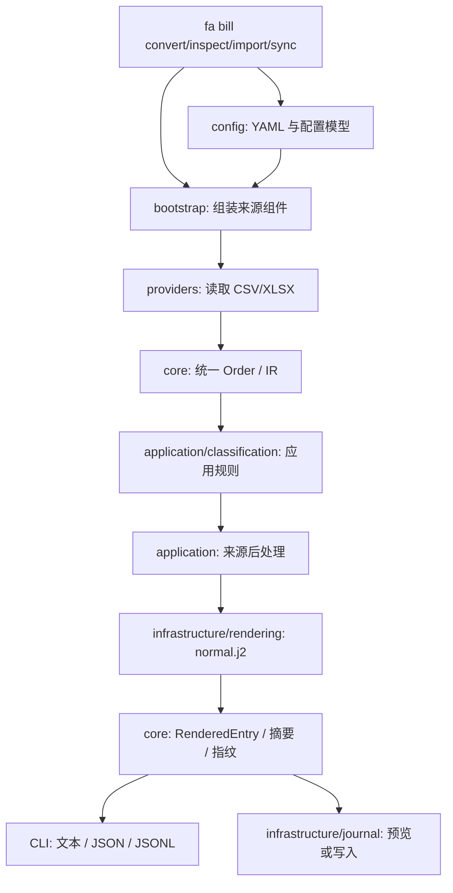

# Fane 项目目录与架构

这篇文档解释“代码放在哪里、为什么分层、从哪里改功能”。使用命令见 [使用手册](USER_GUIDE.md)，完整参数见 [命令参考](COMMANDS.md)。

## 1. 先理解三件事

1. 新业务代码统一在 `fane/`；旧 `package/`、`provider/`、`ir/` 是兼容路径。
2. `bootstrap.py` 将来源、分类器、后处理和模板组装起来。扩展一个来源不需要让核心知道具体 CSV 格式。
3. CLI 与 `tools` 是调用入口，真正的处理逻辑可从 Python 中调用。新入口都在 `fa` 下，tools 只为旧脚本调用保留。

分层沿用 Ekoa 的入口、配置、组装和具体实现分离思路，并针对账单项目保留统一交易模型、分类、渲染和账本写入这些职责。当前是模块化 Python 项目，不需要额外框架或独立服务。

## 2. 新代码目录总览

```text
Fane/
├── fane/                          正式安装的业务包
│   ├── __main__.py                python -m fane 入口
│   ├── bootstrap.py               注册与组装具体组件
│   ├── core/                      统一交易模型、核心转换流程、规则机制、接口
│   ├── config/                    YAML/账本配置模型、加载、诊断
│   ├── providers/                 支付宝和微信文件适配
│   │   ├── alipay/                CSV → 支付宝原始订单 → 统一订单
│   │   └── wechat/                XLSX → 微信原始订单 → 统一订单
│   ├── application/               同步、分类应用、订阅、还款等工作流
│   │   └── classification/        来源分类策略，将 YAML 规则应用于统一订单
│   ├── infrastructure/            文件、锁、模板、Beancount、云存储等具体实现
│   │   ├── journal/               交易文件写入、路由、指纹、同步状态与锁
│   │   ├── rendering/             Jinja2 渲染与 normal.j2
│   │   └── ledger/                Beancount 校验、余额、断言、快照、发布
│   └── entrypoints/               外部调用入口
│       ├── cli/                   fa 的命令组、参数与输出
│       └── legacy/                旧 tools 脚本的参数兼容适配
├── tools/                         历史脚本入口、个人订阅计划及旧 Schema 副本
├── docs/N8N_GUIDE.md              Fane 与独立 Flova 项目的 n8n 集成说明
├── config/                        仓库里的示例/个人 YAML，不是 Python 模块
├── docs/                          使用、参数、配置与架构文档
├── tests/                         自动化验证
├── package/ provider/ ir/         旧 Python 导入路径的兼容包装
└── main.py                        python main.py 兼容入口
```

## 3. core：大家共用的语言和机制

| 文件 | 职责 |
| --- | --- |
| core/models.py | Order、IR、收支类型、账户字段等统一模型 |
| core/ports.py | 来源 reader、分类 resolver、后处理、渲染器的接口约定 |
| core/compiler.py | 分类与后处理一次，再渲染为 RenderedEntry；统计未匹配交易 |
| core/conversion.py | ConversionService、ProviderBinding、转换结果与摘要；不注册具体来源 |
| core/results.py | 渲染结果、订单指纹，用于输出与去重 |
| core/rules.py | 通用规则匹配、金额/时间范围、账户和标签处理 |
| core/matching.py | 字符串候选分隔与子串匹配的小函数 |
| core/errors.py | 分层之间传递的业务异常 |

IR 是 Intermediate Representation，即“统一中间表示”：支付宝叫商品说明，微信叫商品，进入 core 后都叫 Order.item；日期、金额、对方、账户等同理。它不是另一个存储目录或数据库。

core 不读取 YAML，不依赖 pandas/Jinja2/Typer/Beancount，也不导入具体 provider。它通过接口调用注入的组件。统一模型目前用 Pydantic 校验，因此不意味着完全零第三方依赖。

## 4. providers：只管外部账单格式

两个来源目录都有相同职责：

| 文件 | 做什么 |
| --- | --- |
| reader.py | 找表头、检查列、读取 CSV/XLSX、解析原始订单 |
| types.py | 该来源的原始订单和枚举，保留来源特有字段 |
| converter.py | 原始订单转统一 Order，保留订单号/状态等 metadata |

`providers/base.py` 是表格来源共用的读取流程和基础解析工具。它不决定交易记到哪个账户；分类在 application/classification，模板在 infrastructure/rendering。

`provider` 这个词在这里表示“账单来源适配器”，不是 AI 服务商，也不是 Ekoa 的通知渠道。

## 5. config：长期设置及加载约定

| 文件 | 做什么 |
| --- | --- |
| models.py | 顶层 Config、同步任务、来源位置、validator、还款配置 |
| rules.py | 两个来源共用的 YAML 规则字段 |
| alipay.py / wechat.py | 来源特有规则字段及 rules 列表模型 |
| loader.py | 读取 YAML、校验模型，解析模板/还款账本相对路径 |
| ledger.py | ledger 的策略、断言、快照设置，以及账本路径优先级 |
| diagnostics.py | config check 的未知字段、无效兼容字段、路径与模型诊断 |

根目录 `config/bill.yaml` 是具体配置数据。它和 `fane/config/` 的 Python 配置代码不同。更多字段定义见 [配置参考](CONFIG_REFERENCE.md)。

## 6. application：把步骤组织成用户功能

| 路径 | 对应功能 | 做什么 |
| --- | --- | --- |
| classification/alipay.py | bill 转换中的支付宝分类 | 指定有效的支付宝匹配字段及额外收益账户 |
| classification/wechat.py | bill 转换中的微信分类 | 指定有效的微信匹配字段 |
| repayments.py | 支付宝还款后处理 | 过滤部分非交易记录，按配置补充外币信用卡还款分录 |
| sync.py | bill sync | 发现来源 → 缓存判断 → 转换 → 去重路由 → 写入 → validator → 保存状态/失败恢复 |
| fixme.py | classify extract/apply | 扫描占位账户、验证外部决策、构建修改与规则、写入及回滚 |
| subscriptions.py | subscriptions check/generate | 解析月度计划、日期计算、检查已生成记录、追加缺失分录与 include、失败恢复 |
| ai-fixme-decision.schema.json | classify schema | 安装包内的外部分类决策格式 |
| subscriptions.example.json | subscriptions init | 中性的暂停订阅示例，不带个人账户计划 |

这里的 classification 是日常转换的**确定性 YAML 分类**；fixme 是**外部决策应用**。两者共用规则含义，但不是同一种调用流程。

当前 application 可以调用 infrastructure。fixme/subscriptions 保留了部分直接文件操作，这是将既有工具功能纳入包后的实现边界；文档不会把它描述为所有 IO 已完全接口化。

## 7. infrastructure：实际接触文件和依赖

| 目录/文件 | 做什么 |
| --- | --- |
| journal/writer.py | 写分录、读写 JSONL 指纹索引、构建只读导入计划 |
| journal/router.py | 按交易日期/kind/provider 生成 journal 内目标路径 |
| journal/state.py | 文件 SHA-256、同步状态 JSON、基于 fcntl 的进程锁 |
| runtime.py | 外部状态目录及旧 .fane 状态迁移检查 |
| rendering/strategy.py | 模板策略兼容基类 |
| rendering/normal.py | Order → 模板变量，渲染文本并选择历史文件分组 kind |
| rendering/templates.py | 账单/订阅共用变量结构和渲染入口、包资源/外部文件加载、字符串转义和数字精度 |
| rendering/normal.j2 | 账单与订阅唯一的内置 Beancount 模板，统一列宽和元数据格式 |
| ledger/balance.py | 读取账户余额，供还款工作流使用 |
| ledger/validation.py | Beancount + include/账户/币种/元数据业务校验 |
| ledger/assertions.py | 日初余额断言、断言文件和 include 更新 |
| ledger/snapshot.py | 构建用于外部展示的 JSON 快照 |
| ledger/publishing.py | 远程版本检查、校验、单对象快照发布 |

模板就是 `.j2` 文件，不是隐藏在字符串常量中的替代实现。PackageLoader 从安装包加载它，FileSystemLoader 用于 `--template` / template-file 覆盖。删除资源会报错，如何查看和导出见使用手册第 6 节。

## 8. entrypoints 与 bootstrap：入口和组装不是业务层

| 文件 | 做什么 |
| --- | --- |
| cli/root.py | Typer 根应用、全局 config/version、每次调用的延迟配置上下文 |
| cli/bill.py | 新 bill 命令及输出格式、预览/显式写入约定 |
| cli/configuration.py | 新 config 组及 JSON 诊断 |
| cli/catalog.py | providers/template 命令 |
| cli/classify.py | 外部决策输入、默认校验命令、JSON 输出 |
| cli/subscriptions.py | 订阅计划位置和新命令 |
| cli/ledger.py | validate/assertions/export/serve/publish 参数适配 |
| cli/common.py | 新命令共用的错误、输出文件和格式枚举 |
| cli/trans.py / sync.py / setup.py | 历史根命令实现与共享适配；新 bill/config 也复用部分函数 |
| cli/__init__.py | 注册所有命令组与兼容命令 |
| entrypoints/legacy/*.py | 保留两个旧 tools 脚本的 argparse 参数约定 |
| bootstrap.py | PROVIDER_SPECS 注册表，配置绑定分类器，选择模板，构造 converter/sync service |

`main.py`、`fane/__main__.py`、pyproject.toml 的 fa console script 最终使用同一个 Typer 应用。不会存在三份独立命令实现。

## 9. tools：现在只保留历史入口

| 文件 | 现在的职责 | 正式指令 |
| --- | --- | --- |
| tools/ai_fixme.py | 转发到 legacy 参数适配，再调用 application.fixme | `fa classify extract/apply` |
| tools/generate_subscriptions.py | 转发到 legacy 参数适配；保留旧默认个人计划路径 | `fa subscriptions generate` |
| tools/ai-fixme-decision.schema.json | 历史 Schema 副本，当前与安装资源同步 | `fa classify schema` |
| tools/auto_subscriptions.json | 既有个人订阅计划，未打包为通用默认配置 | `--subscriptions tools/auto_subscriptions.json` |

tools 不是外部工具协议目录，也不是供程序导入的公开 Python API。外部工具正式调用 fa 进程、参数、stdin/stdout 和 JSON。安装 wheel 后无需 tools 源码目录，分类和订阅功能仍能工作。

## 10. 为什么根目录还有 package/provider/ir

这些是兼容壳，避免既有脚本、旧测试与导入马上失效。依赖方向是“旧路径 → fane”，新代码不能反向依赖这些壳。

| 旧目录 | 转发到的新位置 |
| --- | --- |
| package/cmd/ | fane/entrypoints/cli/ |
| package/compiler/ | fane/core/compiler.py、conversion/results |
| package/config/ | fane/config/ |
| package/enums/ | fane/core/models.py |
| package/importing/ | fane/application/sync.py + infrastructure/journal/ |
| package/ledger/ | fane/infrastructure/ledger/ + config/ledger.py |
| package/parser/ali/、parser/wechat/ | fane/application/classification/ |
| package/parser/utils/ | fane/core/rules.py、matching.py |
| package/parser/ 其他包装 | bootstrap 与分类/还款的兼容入口 |
| package/strategy/template/ | fane/infrastructure/rendering/ |
| package/template/ | 旧目录占位；内置 j2 已移到新包 |
| provider/ali/、provider/wechat/ | fane/providers/alipay/、wechat/ |
| provider/ 顶层包装 | fane/providers/base.py 与注册表适配 |
| ir/ | fane/core/models.py |

这些目录不再新增业务逻辑。真正删除兼容壳应先迁移外部 Python 导入；隐藏旧 CLI 则应先迁移自动化命令。保留兼容壳不意味着继续维护两套实现。

## 11. 其他根目录、文件与生成物

| 路径 | 做什么 | 日常是否编辑 |
| --- | --- | --- |
| Flova（独立项目） | 服务器适配器和生命周期管理，见 [n8n 指南](N8N_GUIDE.md) | 在 Flova 项目中开发 |
| docs/ | 使用、参数、配置、架构和 n8n 说明 | 功能变更时更新 |
| tests/ | 架构依赖、CLI、同步、格式和账本验证 | 行为变更时更新 |
| .github/workflows/ | GitHub CI，在 Python 3.11/3.13 安装并跑 unittest/compileall | 修改构建验证时 |
| .vscode/ | 本地编辑器设置 | 按需 |
| .git/ | 版本控制元数据 | 不手工编辑 |
| .venv/ | 本地 Python 虚拟环境 | 用包管理器维护 |
| Fane.egg-info/ | editable 安装生成的包元数据 | 不手工编辑，可重新安装生成 |
| build/、dist/（若出现） | 打包生成物 | 不放业务源码 |
| __pycache__/、.ruff_cache/ | Python/静态检查缓存 | 不手工维护 |
| pyproject.toml | 依赖、安装包范围、fa 入口、资源打包、静态检查配置 | 依赖/打包变更时 |
| uv.lock | uv 锁文件 | 依赖更新时由 uv 维护 |
| release.sh | 既有打包/发布辅助脚本 | 发布时审阅；日常用户功能不依赖它 |
| token | 既有本地 token 文件，内容未在本次工作中读取 | 不作为代码、示例或命令参数文档使用 |
| .gitignore | 生成物及本地文件忽略规则 | 新增本地生成物时 |
| LICENSE | 许可证 | 按项目授权维护 |
| README.md | 文档导航与最短开始方式 | 对外入口变化时 |

## 12. 一次转换到底经过哪里


```mermaid
flowchart TD
    CLI[fa bill convert/inspect/import/sync] --> CFG[config: YAML 与配置模型]
    CLI --> BOOT[bootstrap: 组装来源组件]
    CFG --> BOOT
    BOOT --> READ[providers: 读取 CSV/XLSX]
    READ --> IR[core: 统一 Order / IR]
    IR --> CLASS[application/classification: 应用规则]
    CLASS --> POST[application: 来源后处理]
    POST --> RENDER[infrastructure/rendering: normal.j2]
    RENDER --> RESULT[core: RenderedEntry / 摘要 / 指纹]
    RESULT --> OUT[CLI: 文本 / JSON / JSONL]
    RESULT --> WRITE[infrastructure/journal: 预览或写入]
```

分类外部决策链：`fa classify extract → 外部人工/AI → decisions.json → fa classify apply → 文件与规则修改 → validators → 成功或恢复`。

订阅链：`subscriptions.json → SubscriptionService → 月度日期/去重 → NormalOrder → render_normal_order → normal.j2 → --write 更新 journal/include → 加载校验或恢复`。账单与订阅共用模板和渲染入口，订阅不再拼接 Beancount 字符串。`--template` 和 YAML 的 `template-file` 都可以覆盖两类输出。4 空格缩进、默认 55 字符账户列和 10 字符金额列统一在模板中定义；同一分录遇到更长账户或金额时，两行一起扩宽，币种保持对齐。

## 13. 以后修改功能，从哪里入手

| 需求 | 修改位置 | 必要验证 |
| --- | --- | --- |
| 支付宝/微信表头变化 | providers 对应 reader/types/converter | 真实格式的脱敏文件测试 |
| 新账单来源 | 新 providers 目录 + classification 策略 + bootstrap 注册 | 转换、账户分类、输出及重复导入 |
| 新分类条件 | config 规则字段 + core 机制/来源字段映射 + diagnostics | 命中和不命中、规则顺序、两个来源 |
| 改 Beancount 文本格式 | rendering/normal.j2 或外部模板 | 渲染示例并让 Beancount 加载 |
| 新终端动作 | entrypoints/cli，工作流放 application | CLI 输入、输出、退出码和文档 |
| 改去重/状态 | infrastructure/journal + sync | 重复导入、预览、文件变更、回滚 |
| 改订阅/分类工具 | application/subscriptions.py 或 fixme.py | 预览不写、成功写入、失败恢复 |
| 改快照/云发布 | infrastructure/ledger | 本地快照与云客户端模拟测试 |

架构测试限制 core/config/providers/application/infrastructure 的依赖方向，也禁止新包导入旧兼容模块。application 当前允许引用 infrastructure；bootstrap/entrypoints 负责选择具体实现。

运行验证：

```sh
python -m unittest discover -s tests -v
python -m compileall -q fane ir package provider tools tests
# 已安装 Ruff 时：
ruff check fane tools tests/test_cli_v2.py tests/test_architecture.py
```

测试使用临时账单/账本，不会自动修改个人账本、调用 AI 或发布云快照。某些旧回归测试依赖本地 examples，缺少时跳过；云依赖未安装时云模拟测试也可能跳过。
