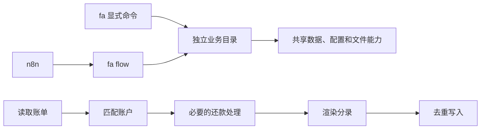

# 架构：从必要行为出发

Fane 的任务是把账单变为正确、可重复导入的 Beancount 分录，并提供分类、订阅、账本操作和查询。n8n 负责触发、获取文件、调用模型和发邮件。架构只为这些实际行为服务。

设计原则：先确认必须成立的事实，再删除不帮助这些事实成立的步骤；能用直接函数调用解决，就不用协议、工厂、插件或第二套入口。模块边界由业务决定。

必须成立的事实：金额和账户正确；同一账单不重复入账；写入校验失败能回滚；并发同步不能覆盖入账；同一月报不能重复发送。指纹、文件锁和发送状态分别保护这些事实，因此保留。

## 最小结构

```text
fane/
  cli.py             显式连接命令；没有自定义命令加载器
  version.py         版本读取
  shared/            配置、数据、规则、模板、账本校验与文件写入
  bill/              读取、转换、还款和增量同步
    conversion.py    完整转换流水线
    providers/       支付宝/微信原始账单解析
    rules/           各来源的规则匹配
  classify/          导出、校验并应用分类决策
  subscriptions/     固定计划与月度分录
  ledger/            断言、快照、Fava 与发布
  query/             查询计算与 HTTP 接口
  flow/              组合已有业务函数与月报状态；供 n8n 调用
integrations/n8n/     工作流定义、提示词、邮件模板与测试
```



业务目录只依赖自身和 shared；flow 可以组合业务目录。业务和 shared 都不能导入 cli 根入口。每个 cli.py 只导出命令，所有连接都在根 cli.py，看代码即可沿调用关系跳转。

CliContext 只保存本次调用的配置，不保存服务容器；Converter 直接选择解析器、匹配账户并渲染。flow 直接调用同一业务函数，不再通过子进程启动一套账单命令。外部校验程序仍按配置执行。

## 拆卸

直接移除不需要的功能目录；根入口中对应的一小段显式注册会因目录不存在而不启用。没有 FANE_MODULES、动态别名或插件注册表。删除 ledger 后，分类、订阅、查询和账单仍使用 shared 的账本能力。

flow 是组合功能。删除 bill、classify、subscriptions 后，依赖它们的账单入账组合自然不可用；不依赖它们的同步仍可运行。卸下 query 后月报不可用，其他业务仍独立。依赖业务行为的流程不能靠空壳假装仍然可用。

账单解析器也可拆卸：删除 providers/alipay 不阻止微信转换。第三方依赖仍统一随完整安装包安装，不再增加一层安装插件系统。

## 修改入口

| 要做什么 | 修改位置 |
| --- | --- |
| 新增来源 | bill/providers 下增加解析器，在 bill/conversion.py 显式选择来源与规则 |
| 修改来源字段读取 | 对应 providers 下的 reader.py、converter.py、types.py |
| 添加个人分类规则 | 配置 YAML 中 alipay.rules 或 wechat.rules |
| 修改规则语义 | shared/rules.py、shared/matching.py、bill/rules/ |
| 修改分录格式 | shared/render/normal.j2；也可用 --template 指定外部模板 |
| 修改导入去重/路由 | shared/results.py、shared/journal/；不要改变已入账指纹身份 |
| 修改分类写入 | classify/service.py 的 apply_decisions |
| 修改 n8n 入账 | flow/bill.py；入口依然是 fa flow bill |
| 修改月报 | flow/report.py、flow/snapshot.py 和 integrations/n8n 的报告资源 |
| 新增命令 | 业务 cli.py，再在根 cli.py 显式连接 |

旧导入壳、动态别名、旧根命令、协议端口、ProviderSpec/Binding 工厂和独立执行脚本已删除。持久化的账本、去重身份、订阅标记和报告状态属于真实财务数据，保留其读取语义。

## 验证

```sh
FANE_STATE_HOME=/tmp/fane-test-state python -m unittest discover -s tests -v
python -m unittest discover -s integrations/n8n -v
node integrations/n8n/test_report.js
python -m compileall -q fane tests integrations/n8n
```

测试使用临时账单与账本，验证实际指令、模块物理拆卸、金额与指纹、重复执行、分类和订阅回滚、HTTP 查询、签名、文件锁与报告发送状态。流水线修改还应对同一夹具比较修改前后的分录及 JSON。
